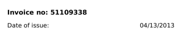

Optical Character Recognition (OCR) is used to convert images of text into a machine-readable text format.

<iframe width="560" height="315" src="https://www.youtube.com/embed/or8AcS6y1xg?si=aqj4Rst0S0HjmxTS" title="YouTube video player" frameborder="0" allow="accelerometer; autoplay; clipboard-write; encrypted-media; gyroscope; picture-in-picture; web-share" referrerpolicy="strict-origin-when-cross-origin" allowfullscreen></iframe>

---

## Optical Character Recognition (OCR)

Optical Character Recognition (OCR) is the process of converting images containing text into machine-readable text.

This allows computers to extract text from:  
* Scanned documents  
* PDFs without embedded text  
* Photos of receipts or invoices  
* Screenshots

---

## What OCR Actually Does

OCR does one thing: converts pixels into characters.

It does not:  
* Understand document meaning
* Identify structured fields
* Know what a "total amount" is
* Understand that something is a data

OCR only gives text, so it serves as only the first step in document intelligence.

---

## Where OCR Fits in the Pipeline

In a document intelligence workflow:  
1. **OCR:** Convert images to text  
2. **Parsing/Post-Processing:** Extract structure  
3. **Validation/Logic:** Clean and verify fields  
4. **Storage/Use:** Save to database or downstream system.

---

## Example

**Input image:**



**OCR Output:**
```
Invoice no: 51109338

Date of issue: 04/13/2013

```

---

## 📚 Additional Resources

- [What is OCR (Optical Character Recognition)?](https://aws.amazon.com/what-is/ocr/)
- [What is optical character recognition (OCR)? ](https://www.ibm.com/think/topics/optical-character-recognition)


