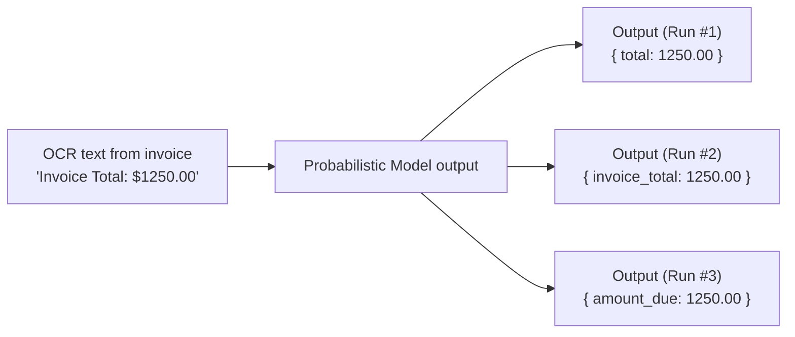

<!-- 
Local Language Models	Explain what a language model is and how it differs from rule-based approaches	Remember, Understand
Local Language Models	Use HuggingFace transformers to run a local language model	Apply
Local Language Models	Design prompts that specify structured JSON output	Apply
Local Language Models	Compare LLM-based extraction results against OCR + regex approaches	Analyze

- We are going to build on the previous session 

OCR and manual extraction 


- pros and cons towards the end 

- What is a language model?

Working with local models from HuggingFace using the transformers library.
Prompt techniques. Specifying output format.

Hands-On Problems:
Use a local model to parse an invoice and output JSON.
Week 2, Session 2: Working with Local Language Models
Concept Content

Explain what a language model is and how it differs from rule-based and traditional NLP approaches
Introduce local language models and the benefits/tradeoffs compared to API-based models
Demonstrate how to run local models using HuggingFace and the transformers library
Teach prompt techniques with an emphasis on:
Instruction clarity
Specifying structured output (JSON)
Hands-On Exercise

Guide students through using a local language model to parse invoice text
Require the model to output structured JSON
Include examples of imperfect or inconsistent model output for discussion
LO Alignment

Explain language model fundamentals
Apply local LLMs to document extraction
Design prompts that enforce structured output
Analyze LLM output quality

need to talk about limitations of local models
need to talk about hugging face 
what is a prompt 
schema validation and retries - how and why its needed 
 -->

In the previous sessions, we used OCR to convert invoice images into unstructured text, and then applied manual, rule-based techniques to extract structured information from that text. The step that transformed messy OCR output into labeled fields was deterministic and driven by explicit rules that we wrote ourselves.

In this session, we will approach the same task using a different type of tool. We will still use OCR to obtain unstructured text from the invoice image, but instead of manually writing extraction rules, we will pass that text to a Large Language Model running locally on our computer. The model will help us automatically interpret and organize the invoice content.

A Large Language Model is a probabilistic type of machine learning system. Before we use it for document extraction, we need to understand a few foundational ideas like what it means for a system to be deterministic versus probabilistic, what machine learning is, what a Large Language Model actually does, and how it can turn unstructured invoice text into structured data.

## What is a Machine Learning program

Traditional software is built by writing explicit rules. Developers define exactly what should happen, and the computer executes those instructions on the input data.

```python
if room_temperature > 75:
    print("Turn off thermostat")
```

We can be certain that if the `room_temperature` variable is set to `80`, the program will print "Turn off thermostat". We can read the code without running it and determine its behavior. This program is deterministic.

Machine Learning systems work differently. Instead of developers writing detailed rules, they provide examples of input data along with the desired outputs. The system analyzes those examples and learns patterns that connect inputs to outputs. The learned logic is not written directly by developers but encoded inside the model.

<iframe width="1120" height="630" src="https://www.youtube.com/embed/PeMlggyqz0Y?si=l5lrO53t_dy42xRb" title="YouTube video player" frameborder="0" allow="accelerometer; autoplay; clipboard-write; encrypted-media; gyroscope; picture-in-picture; web-share" referrerpolicy="strict-origin-when-cross-origin" allowfullscreen></iframe>


Because we do not manually program the rules, it is much harder to trace why certain outputs are created. These systems are probabilistic. Probabilistic systems may produce slightly different outputs even when given the same input multiple times.




| System Type        | Pros                                                                 | Cons                                                                 |
|--------------------|----------------------------------------------------------------------|----------------------------------------------------------------------|
| Deterministic      | Predictable behavior; we know exactly what will happen.            | Brittle; if the invoice format changes, the extraction code may break. |
| Probabilistic      | Handles variation and changing formats more effectively.           | Requires validation and monitoring to ensure results remain correct. |


## What Is a Large Language Model?

A Large Language Model (LLM) is a Machine Learning system trained on large amounts of text. Its core task is simple: given a sequence of text, probabilistically predict the next token. A token is a small piece of text, such as a word, part of a word.

The model predicts one token at a time, adds it to the sequence, and repeats the process to generate a full response. Although this task seems simple, predicting the next token requires capturing patterns in grammar, structure, formatting, and context. The model does not understand text like a human; it generates output by applying learned probabilistic patterns across the text it was trained on.

<iframe  width="1120" height="630"  src="https://www.youtube.com/embed/5sLYAQS9sWQ?si=S6opKJg22_EqC63p" title="YouTube video player" frameborder="0" allow="accelerometer; autoplay; clipboard-write; encrypted-media; gyroscope; picture-in-picture; web-share" referrerpolicy="strict-origin-when-cross-origin" allowfullscreen></iframe>

## How does an LLM actually make sense of unstructured invoice text?
When we give the model text that came from an invoice image (after OCR has converted the image to text), it does not “read” the invoice the way a human does. Instead, it looks at the text and predicts what structured information should come next based on familiar patterns. For example, if it sees “Invoice Total” followed by a number, it can infer that the number is the total amount. By continuing this pattern recognition, it can reorganize messy OCR text into structured output, such as clearly labeled fields in JSON.